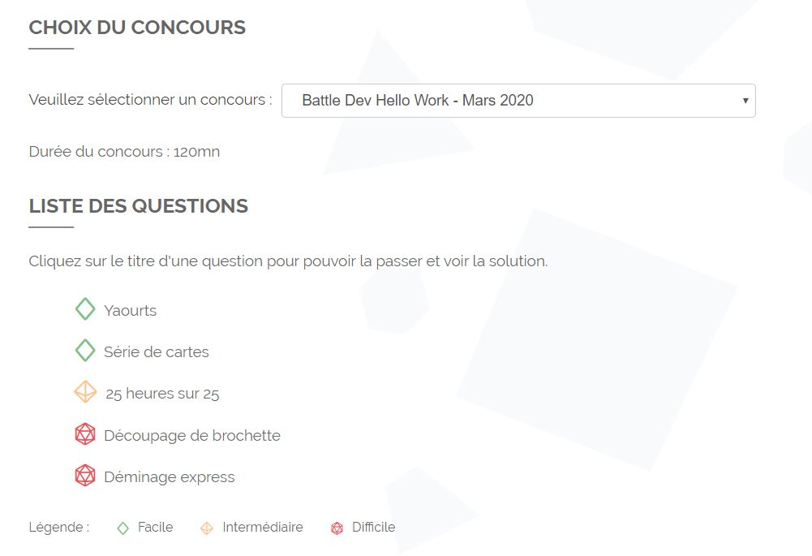

# Exercice 4

Les examples de cet exercice sont nuls ! A tel point qu'ils ne l'ont pas mis en ligne pour qu'on puisse le refaire.

## Hiérarchie des types / Qui bat qui ?

Ca ne suit pas du tout les ordres originels.

-   Feu vs Eau: Eau l'emporte
-   Feu vs Plante: Feu l'emporte
-   Feu vs Glace: Feu l'emporte

-   Eau vs Plante: Plante l'emporte
-   Eau vs Sol: Sol l'emporte

-   Plante vs Poison: Plante l'emporte
-   Plante vs Sol: Sol l'emporte
-   Plante vs Vol: Plante l'emporte

-   Si le résultat d'un affrontement entre deux types n'est pas précisé, alors aucun type n'est plus puissant que l'autre par défaut.

## Examples

Les exemples 1, 4 et 7 ne correspondent pas aux conditions données dans le sujet. J'ai l'impression que la hiérarchie des types a été changé en cours de conception de l'exercice.
Pour les autres exemples, je pense qu'ils sont bons.

### Example 1

C'est l'exemple du sujet, il ne marche pas si on suit les conditions données.
La solution proposée est : `eau, plante, vol`

#### Tour 1

| Joueurs / Carte | 1   | 2      | 3      |
| --------------- | --- | ------ | ------ |
| Sacha           | Feu | Sol    | plante |
| Moi             | eau | plante | vol    |

#### Tour 2

| Joueurs / Carte | 1       | 2      | 3      |
| --------------- | ------- | ------ | ------ |
| Sacha           | &empty; | Sol    | plante |
| Moi             | eau     | plante | vol    |

#### Tour 3

| Joueurs / Carte | 1       | 2      | 3      |
| --------------- | ------- | ------ | ------ |
| Sacha           | &empty; | Sol    | plante |
| Moi             | &empty; | plante | vol    |

#### Tour 4

| Joueurs / Carte | 1       | 2       | 3      |
| --------------- | ------- | ------- | ------ |
| Sacha           | &empty; | Sol     | plante |
| Moi             | &empty; | &empty; | vol    |

#### Tour 5

| Joueurs / Carte | 1       | 2       | 3       |
| --------------- | ------- | ------- | ------- |
| Sacha           | &empty; | &empty; | plante  |
| Moi             | &empty; | &empty; | &empty; |

On voit que c'est Sacha qui gagne avec cette configuration.

### Example 4

#### Tour 1

| Joueurs / Carte | 1   | 2   | 3   | 4   | 5   |
| --------------- | --- | --- | --- | --- | --- |
| Sacha           | sol | feu | sol | sol | sol |
| Moi             | sol | eau | sol | sol | sol |

#### Tour 2

| Joueurs / Carte | 1       | 2   | 3   | 4   | 5   |
| --------------- | ------- | --- | --- | --- | --- |
| Sacha           | &empty; | feu | sol | sol | sol |
| Moi             | &empty; | eau | sol | sol | sol |

#### Tour 3

| Joueurs / Carte | 1       | 2       | 3   | 4   | 5   |
| --------------- | ------- | ------- | --- | --- | --- |
| Sacha           | &empty; | &empty; | sol | sol | sol |
| Moi             | &empty; | eau     | sol | sol | sol |

#### Tour 4

| Joueurs / Carte | 1       | 2       | 3   | 4   | 5   |
| --------------- | ------- | ------- | --- | --- | --- |
| Sacha           | &empty; | &empty; | sol | sol | sol |
| Moi             | &empty; | &empty; | sol | sol | sol |

#### Tour 5

...

#### Tour 7

| Joueurs / Carte | 1       | 2       | 3       | 4       | 5       |
| --------------- | ------- | ------- | ------- | ------- | ------- |
| Sacha           | &empty; | &empty; | &empty; | &empty; | &empty; |
| Moi             | &empty; | &empty; | &empty; | &empty; | &empty; |

Comme dit dans l'énoncé, on ne gagne pas par KO mutuel.

### Example 7

#### Tour 1

| Joueurs / Carte | 1      | 2     | 3      | 4      | 5   | 6   | 7      | 8      | 9      | 10     |
| --------------- | ------ | ----- | ------ | ------ | --- | --- | ------ | ------ | ------ | ------ |
| Sacha           | sol    | glace | poison | sol    | sol | vol | poison | plante | plante | glace  |
| Moi             | plante | eau   | poison | poison | feu | vol | poison | glace  | sol    | plante |

#### Avant dernier tour

| Joueurs / Carte | 1       | 2       | 3       | 4       | 5       | 6       | 7       | 8       | 9       | 10      |
| --------------- | ------- | ------- | ------- | ------- | ------- | ------- | ------- | ------- | ------- | ------- |
| Sacha           | &empty; | &empty; | &empty; | &empty; | &empty; | &empty; | &empty; | &empty; | &empty; | glace   |
| Moi             | &empty; | &empty; | &empty; | &empty; | &empty; | &empty; | &empty; | &empty; | &empty; | &empty; |

## Solution proposées

Je n'ai pas trouvé de meilleure solution que le brute force.

-   [exo4_original_thibault.py](./exo4_original_thibault.py) : J'ai réussi à le passer en faisant un random de l'input pour changer l'ordre dans lequel mon algorithme utilise les cartes. Sans ça je ne teste pas tous les cas.
-   [exo4_without_random_thibault.py](./exo4_without_random_thibault.py) : J'ai essayé de le refaire sans les randoms. Il fonctionne sur les exemples qui ne sont pas moisis.
