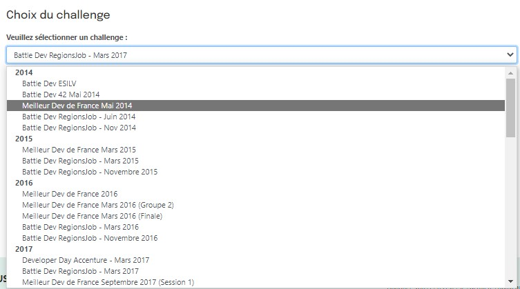
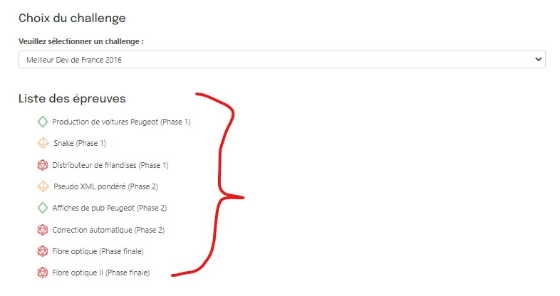
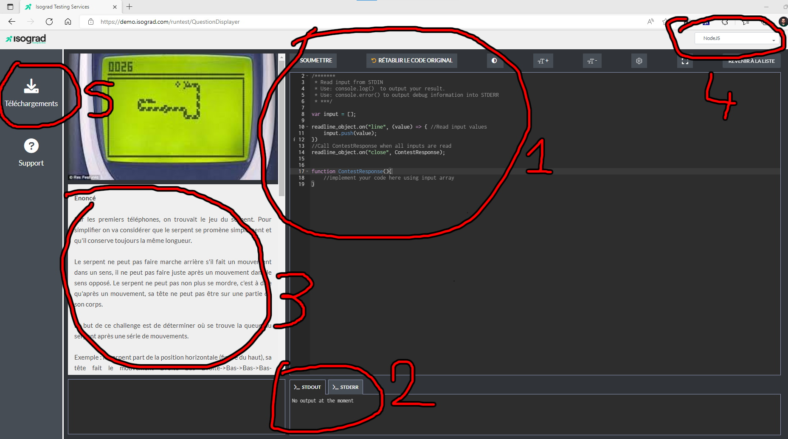
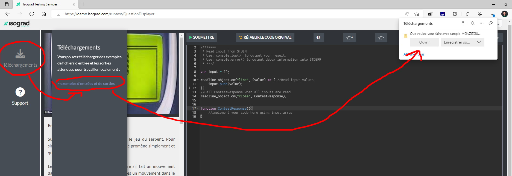

Here's a quick summary on how to participate/use the isograd platform (both to train and participate in events such as the *BattleDev*, *Meilleur dev de France*, and *TechChallenger*)

URL : https://www.isograd-testingservices.com/FR/solutions-challenges-de-code

When you get on the webpage, you get access to a list of the different contests hosted on isograd. 

Once you select a contest, you can choose one of the few exercices that was proposed during that contest. There is a color code to classify teh exercice's difficulty. Green: easy, Yellow: medium and Red: hard.

On the following image, there are a few things to note:

- 1 The zone used to write and submit your code
- 2 The output console and debug console
- 3 The exercice's summary
- 4 The dropdown to change the programming langage
- 5 A button to download a few pair of inputs/outputs corresponding to the exercice

Here's what happens when you press the button

---

This repository's main purpose is to provide an environment to be able to play tests using inputs/outputs and do debugging on your code

We currently have environments for nodeJs, Java and C#, if you're using another langage, you should strongly think of setting up an environment enabling you to do the same (even sharing it on this repository, we're open to PRs)

